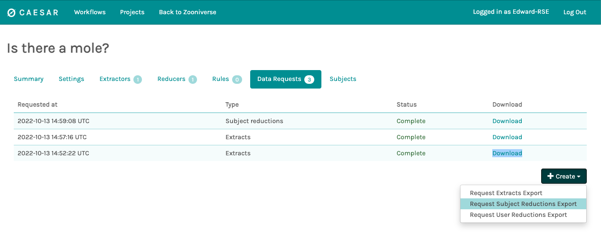

Classifications
===============

*MoleMarshal* does not deal with the raw data to label a stamp with a classifications. This is instead handled by
Zooniverse’s Panoptes and Caesar backends. The classification data from these two services are passed to *MoleMarshal*
which links the classifications to subjects and stamps in the *MoleMarshal* database.

Extractors and reducers
-----------------------

*MoleMarshal* doesn’t use the pre-baked classifiers in Panoptes, and uses `Caesar <https://caesar.zooniverse.org>`__
instead which provides more flexibility and customization if that will be required later. In Caesar, an extractor and a
reducer are set up. Whenever a user classifies a stamp image, the extractor and reducer are run, and the classification
for the stamp just classified by the user is updated.

What exactly an extractor and reducer are does not matter too much. The extractor is essentially a step which transforms
the classification data into a flat table, e.g. it extracts data from the Panoptes API. The reducer is a step which
takes the flat *extracted* data and combines all of the individual classifications into a single consensus result. This
can be as simple as the most popular answer for the question, or can be quite complex and take into account the
“reliability” of a user and weight their classifications.

Reducers in the project **must** also be defined in the *MoleMarshal* configuration file under the reducers section,

.. code:: ini

   [REDUCERS]
   mole-classification = T0
   severity-classification = T1

The entries under this section exist as a "reducer-key = task-index" pair/syntax, where "reducer-key" is the name of key
of the reducer in Caesar and "task-index" is the key for the task in the Zooniverse workflow as you would assign the
task to the reducer when configuring the Caesar reducer.  Each reducer **must** have an entry in the configuration file
if you wish to translate the data stored in the classification database table (discussed later in this page) into the
"actual" answers users are shown. A common mistake is to not populate this section of the configuration file, and is an
easy hole to fall into as most of the classifications workflow will work without this section.

Getting classifications from Caesar
-----------------------------------

*MoleMarshal* can handle downloading the classification data itself on a by workflow and subject basis. To get the
specific classification for a subject in a workflow,

.. code:: python

   from panoptes_client import Caesar
   from panoptes_client import Workflow

   from molemarshal.zooniverse.zooniverse import connect_to_zooniverse
   from molemarshal.zooniverse.classifications import get_specific_reducer_classification_for_subject
   from molemarshal.zooniverse.classifications import get_workflow_classifications

   # as this data sits on the zooniverse server, you need to login

   connect_to_zooniverse()

   # we need a caesar object to interact with the stuff on Caesar

   caesar = Caesar()

   # To get all of the classifications for a single workflow for all the
   # reducers part of the workflow, use the following function

   workflow_classifications = get_workflow_classifications(session, caesar, WORKFLOW_ID)

   # The output will be a list of dicts, workflow_classifications = [
   #   {
   #        "classification_id": classification_id,
   #        "subject_id": subject.subject_id,
   #        "answer_index": int(classification),
   #        "reducer_key": reducer["key"],
   #   },
   #   {
   #     ...
   #   },
   # ]

The classifications from Caesar are not strings, but instead come as a key: value pair, where the value is not actually
provided. The key is an integer which corresponds to the index of an answer for the current task in a workflow; as
reducers are task specific as well. To turn the key into a value, you need an order list of answers,

.. code:: python

   from panoptes_client import Workflow

   from molemarshal import config
   from moledb import connect_to_database_engine
   from moledb.classification import Classification

   from molemarshal.zooniverse.classifications import convert_index_to_answer
   from molemarshal.zooniverse.classifications import get_workflow_task_answers

   workflow = Workflow.find(WORKFLOW_ID)
   workflow_answers = get_workflow_task_answers(workflow)

   # to then match an "answer_index" key to a value, e.g. for the subject earlier
   answer_index = 1
   reducer_key = "mole-classification"
   reducer_task_index = config["REDUCERS"][reducer_key]
   classification_value = workflow_answers[reducer_task_index][answer_index]

   # there also exists a convenience function to translate answer_index into
   # the actual classification.
   # For example, if you want to get all the classification values/answers for
   # a specific subject in the database you can create a list comprehension
   # as such

   with Session(connect_to_database_engine) as session:
      classification_values = [
         convert_answer_index_to_value(classification.reducer_key, classification.classification, workflow_answers)
         for classification in session.query(Classification).filter(Classification.subject_id == SUBJECT_ID)
      ]

With all this data, you can now begin to link classifications to stamps, as you have the ID of the subject and the
classification for the subject. Each subject entry in the subjects table in the *MoleMarshal* database has a link to the
stamp it is a subject of, therefore it is easy to link a classification to both a stamp image and subject which lives in
a subject set on the Zooniverse servers.

Adding classifications to the database
--------------------------------------

It is not required to download the data manually and match it to stamps. The script
``molemarshal`` will do that for you. To use the script, you need to know the ID of the
workflow to get classifications from, the index of the task you want to extract data from and the name of the reducer.
The main reducer is named “mole-classification”, but that can be checked on the
`“Reducers” <https://caesar.zooniverse.org/workflows/22510#reducers>`__ tabs on
`Caesar <https://caesar.zooniverse.org>`__.

The script has the following usage,

.. code:: bash

   $ molemarshal update classifications

There will be no data output, unless the script is run with debug outputs. The classifications will live in the
classifications table in the :meth:`Database`, which is documented elsewhere. If debug is enabled
then a CSV file of the classifications will be written to disk in the working directory.

In the classifications table, the classification entries have a link to the subject and stamp they are a classification
for. Each classification is unique, and each subject and stamp may have multiple classifications.

